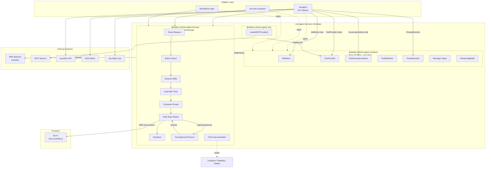
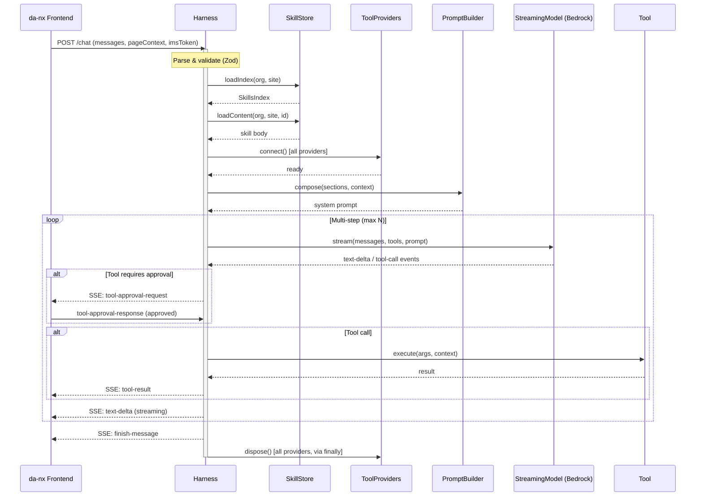
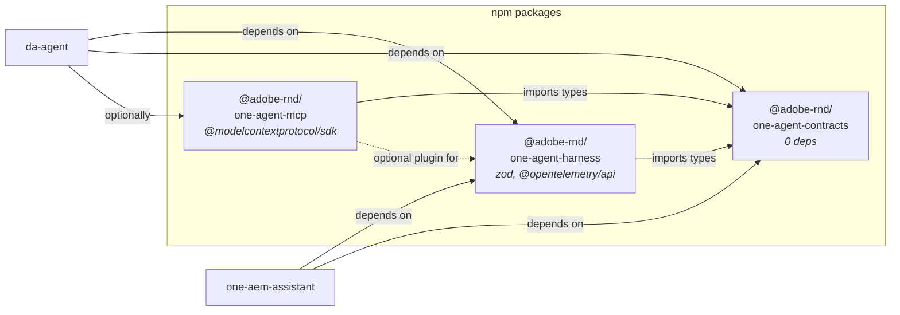

> Extracted from agent session, 2026-05-18.

# one-agent-harness Architecture Diagrams

Mermaid diagrams derived from ADR-001 (`docs/adr/001-one-agent-harness-architecture.md`).

---

## 1. Component Topology

---

## 2. Request Lifecycle (Sequence)

---

## 3. Package Dependency Graph

